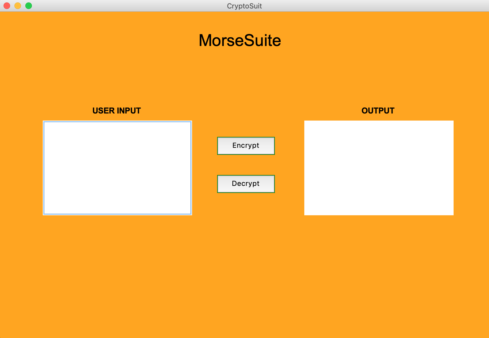

# Morse-Code-Translator

A simple tool which can easily convert your plain text having alphabates from A to Z, numbers from 0 to 9 and some special symbols into a encrypted morse code format. Also it can convert your morse code into plain text.

<b>MORSE CODE</b>

Morse code is a method of converting plain text into a series of on-off tones, lights or clicks or some dots & dashes format text which can be understood only by a skilled listener or observer. It was named after the inventor of telegraph Samuel F.B Morse.

<b>ALGORITHM FOR MORSE CODE TRANSLATOR</b>

The algorithm for morse code translator is very simple. In this we have convert each alphabet into its corresponding  dot & dashes or only with dot or dashes in some cases and vice-versa.

<b>MODULES USED</b>

1. dictionary.py  :- This module consists of a morse code dictionary having keys and values for the conversion.
2. encryption.py  :- This module consists of a function which is used to convert normal text into morse code.
3. decryption.py  :- This module consists of a function which is used to convert morse code into plain text.
4. gui.py         :- This is the module where you can run the code with its simple GUI interface.
5. gui_support.py :- This is module with try and except for importing the right library and for displaying GUI.
6. run.py         :- This module deals with running of code with GUI. It is terminal based for the sake of simplicity.

